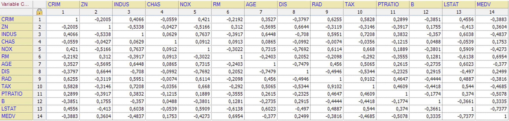
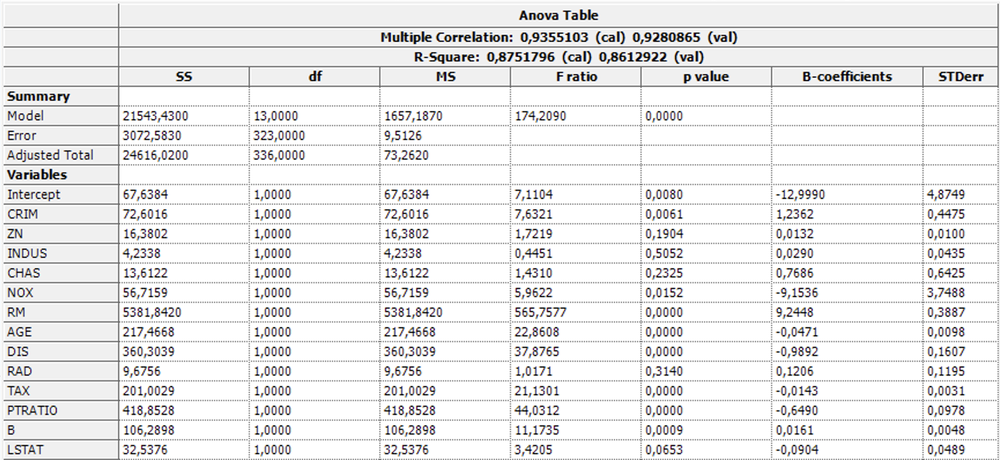

# MLR on housing data in unscrambler

## Correlation matrix: Are the correlations as expected?

Yes, the correlations are as expected. Here are some examples:

- The amount of crime is negativly correlated with the average number of rooms per house. 
- The NOX concentration is positivly correlated with the proportion of non-retail business per acres.
- The distance form five Boston employment centers are negativly correlated with the amount of industry in the area.

## Multiple linear regression (MLR):

### ANOVA table:
The ANOVA (Analysis Of Variance) table shows many different massures when it comes to the variance of each variable and between the different variables in the data set. 

The first column is the SS (Squared Sum) this column consists of different sums of squares describing the variability between different parts of the data. 

The model field is the sum of squares between the group mean and the grand mean. This quantifies the variability between the different groups. 

The error field is the sum of squares betweent he data and the group means. It quantifies the variability within the groups. 

The total field is the sum of squares between the n data points and the grand mean. I quantifies the total variability in the obserbed data. 

The variable fields descibes the sum of squares of the internal variance in the variable. 

The df column is contains the degrees of freedom for the model. 

The MS column is the mean square error of the model. As you can see the MS of the different variables is the same as the sum of squares for that variable. This is because the MS is calculated as the sum of squares.

The F ratio column contains the F-statistics of the variable. This statistic tells something about how the variance of the variable compares to the variance between the different variables. F = variation between samples / variation within the samples. A high F-value indicates that there are difference in the means of the different samples and a low F-values indicates that the samples may have the same mean. 

### Predicted vs. reference:

